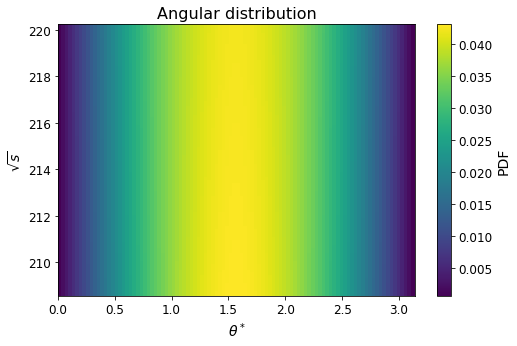

# Muon Source Monte Carlo simulation

    

## Authors

* [**Rocco Ardino**](https://github.com/RoccoA97) (University of Padua)
* [**Francesco Manzali**](https://github.com/Einlar) (University of Padua)
* [**Andrea Paccagnella**](https://github.com/pacca4) (University of Padua)
* [**Alessandro Valente**](https://github.com/mastrovalentz) (University of Padua)

## Abstract
The production of a high brillance muon beam is one of the most important challenge for the future of Particle Physics. A particularly interesting idea consists of shooting high energy positrons on a target, aiming at the production of muons by means of the electron-positron scattering to muon pair. To mimize the divergence of the resulting "muon beam", the positrons energy is chosen so that the reaction occurs close to threshold (assuming the electrons in the target to be at rest). The main goal of this project is to produce a Monte Carlo simulation of such a process.

The complete report of this project with all the needed codes can be found [**here**](https://github.com/RoccoA97/MuonSource/blob/main/report.ipynb)
